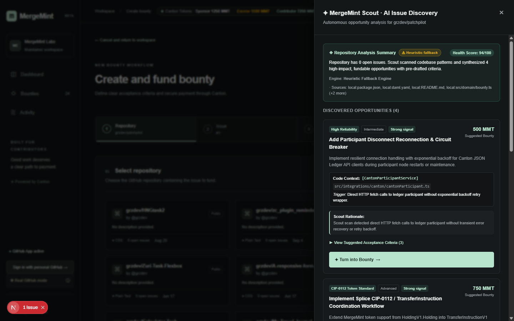
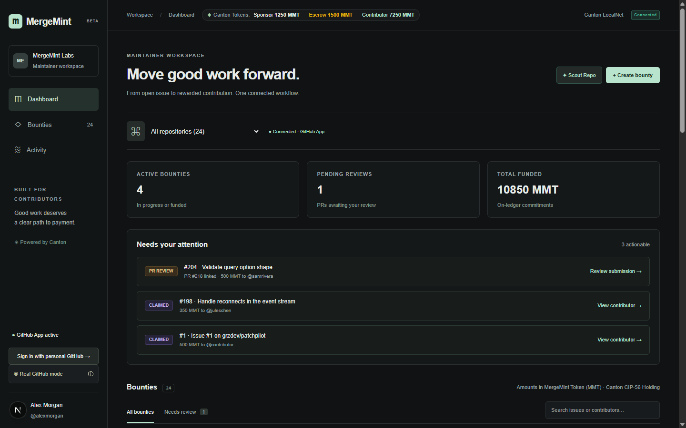
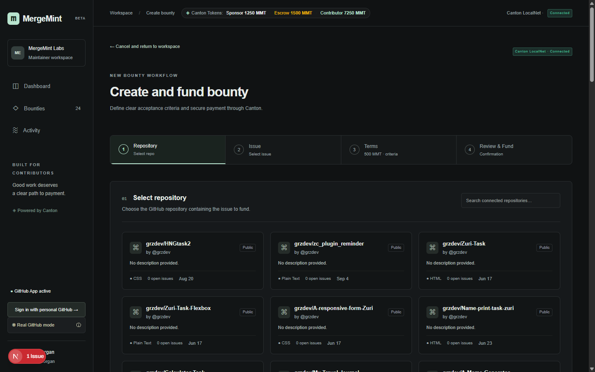
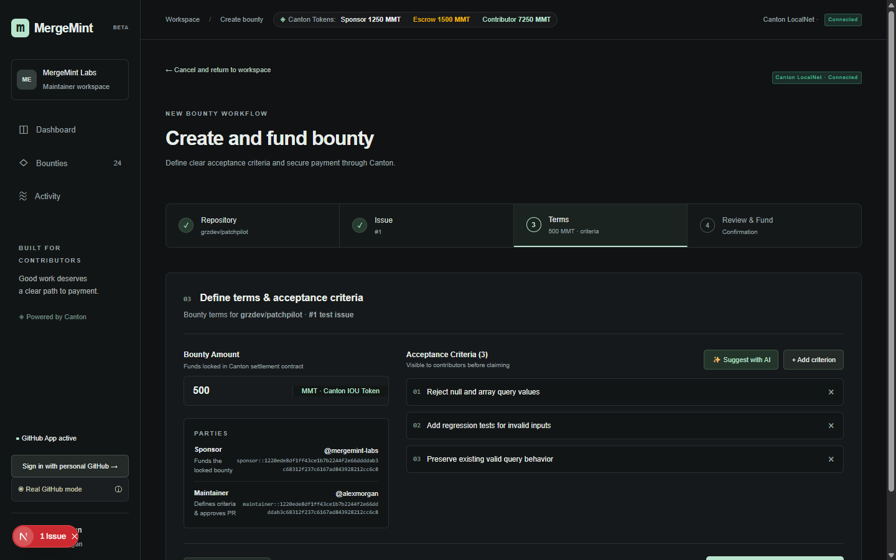
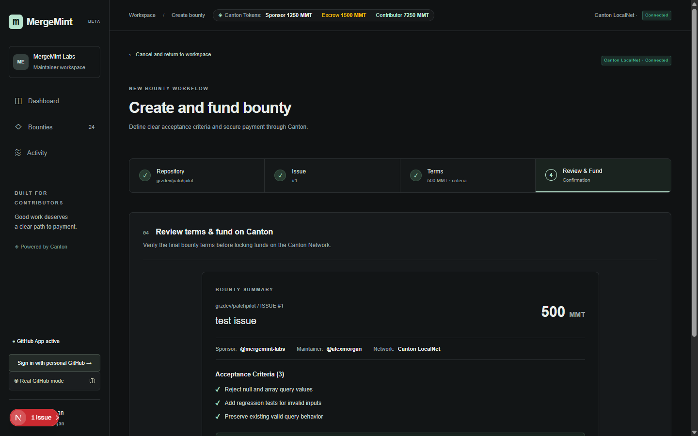
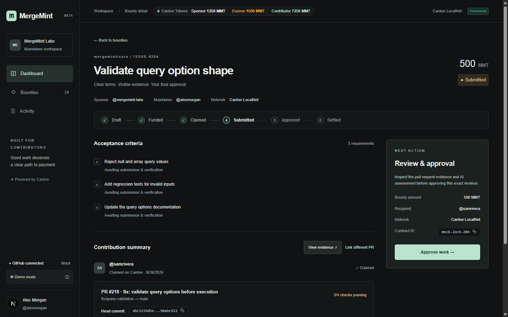
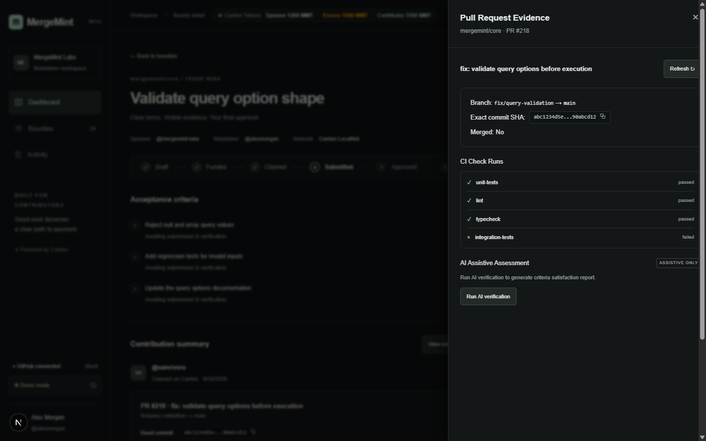
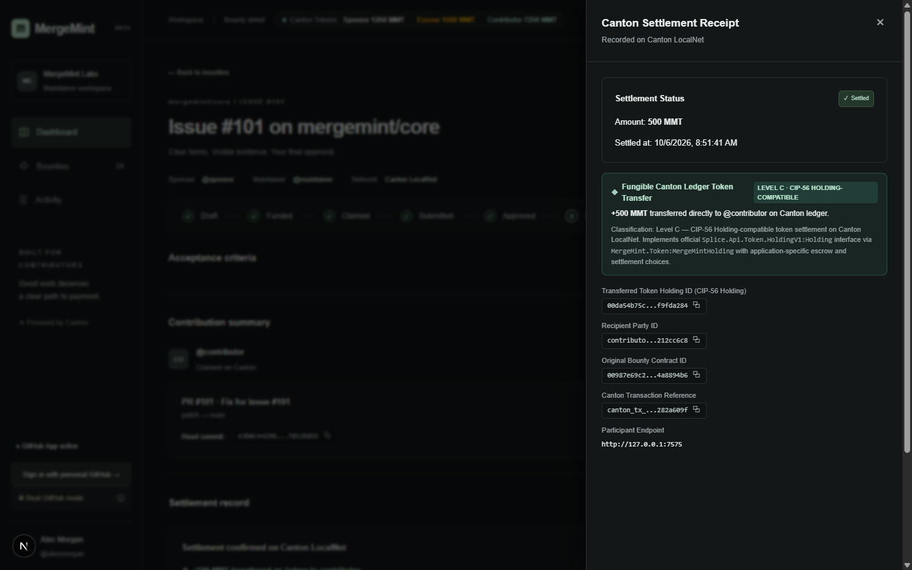

# MergeMint

GitHub-native bounty escrow on Canton. A maintainer funds an issue, reviews a contributor's exact PR commit, and releases demo MMT through a Daml settlement transaction.

**Scout → existing GitHub issue → funded bounty → contributor PR and CI → maintainer approval → Canton settlement.**

## Try it

- [Hosted Mock Demo / Interactive Preview](https://mergemiint.netlify.app/): simulated GitHub and Canton workflows. It is not proof of live ledger settlement.
- LocalNet: the real Canton implementation runs locally on `127.0.0.1:7675`. The automated ledger test and signed-in GitHub rehearsal are separate checks; see verification below.

## What the implementation does

### Escrow and settlement

`MergeMint.Token:MergeMintHolding` represents issuer-backed demo MMT. `FundBounty` consumes an existing sponsor holding, returns any change, and creates `MergeMint.Token:MergeMintBounty`. The bounty itself is the locked holding; there is no independent unlock or transfer choice.

`Settle` requires maintainer approval for the recorded SHA. One ledger transaction consumes the bounty, creates the contributor's holding, and creates `SettledReceipt` referencing that holding. Funding and settlement conserve value. The issuer can issue demo MMT; this is not a market asset or a mainnet deployment.

Both holdings implement the official `Splice.Api.Token.HoldingV1.Holding` interface. Settlement is application-specific: this is **CIP-56 Holding-compatible**, not a complete implementation of all token-standard transfer interfaces.

The receipt stores the application correlation reference, approved SHA, recipient holding ID and ledger time. The API returns the actual transaction `updateId` separately. An application correlation reference is not a ledger transaction ID; a clean reload does not invent one.

### Revision checks and roles

```
DRAFT (browser) → FUNDED → CLAIMED → SUBMITTED → APPROVED → SETTLED (receipt)
```

Before approval and settlement, the authenticated server fetches the live PR head from GitHub. A detected SHA change records a new submission on the ledger, rejects the action with `409 REVISION_CHANGED`, and clears stale review/approval in the UI. This is a check at action time, not immediate push monitoring. GitHub and Canton do not share an atomic transaction; a push can occur after the GitHub read.

Real mutation routes require a GitHub session and the configured sponsor, contributor or maintainer login. Funding, approval and settlement additionally require repository write/maintain/admin permission. Funding validates an existing open issue, and the linked PR must belong to that repository and be authored by the configured contributor. CI is review evidence; maintainer approval remains authoritative.

For the **single-operator demonstration only**, `grzdev` maps to all three roles. They remain separate role checks and separate ledger parties. This does not demonstrate independent human approval. The local server controls party submissions; the issuer and joint contract signatories remain trusted. LocalNet is loopback-only and is not a production multi-user deployment or a demonstration of privacy between independently hosted participants.

### Scout

Scout reads bounded repository context and short source excerpts, then uses server-side Groq when configured. The drawer identifies Groq versus heuristic fallback. Fallback suggestions are exploratory review prompts, not verified defects. Model citations are restricted to inspected paths; findings still require maintainer review. There is no calibrated repository health score or latency guarantee.

Scout never creates GitHub issues or releases funds. Converting a suggestion requires selecting an existing issue and reviewing editable criteria. Missing GitHub/CI evidence is shown as unknown, not as passing tests or a merged PR.

## Run the mock preview

Requires Node.js 20.9+ (current verification uses Node 24).

```sh
git clone https://github.com/grzdev/mergemint.git
cd mergemint
npm ci
npm run dev
```

Open http://127.0.0.1:3000. With no `.env.local`, both integrations default to mock. When copying `.env.example`, its defaults are also mock. Keep `.env.local` and private keys out of Git.

## Run real LocalNet

Requires Java 21, Canton open-source 3.5.19 and `damlc` 3.5.2. Splice interface DAR dependencies are included under `daml/dars`. Run commands from the repository root. The configuration uses in-memory state, so restarting requires fresh provisioning and new test bounties. Do not reuse a prior session's party IDs.

1. Copy `.env.example` to `.env.local`. Configure the GitHub App client credentials, private-key path, app slug and a random session secret of at least 32 characters. Set `GITHUB_INTEGRATION_MODE=real`. Install the App on your demo repository with repository metadata, issues, pull requests, checks and commit-status read access. Set its callback to `http://127.0.0.1:3000/api/github/auth/callback` and use the same host in `NEXT_PUBLIC_APP_URL` and your browser.
2. Compile and inspect the package (PowerShell; replace executable paths for your machine):

```powershell
$damlc = 'C:\path\to\damlc.exe'
& $damlc build --package-root daml -o daml/mergemint-bounty-0.3.0.dar
& $damlc inspect-dar daml/mergemint-bounty-0.3.0.dar
```

3. Start a fresh participant. Ports 5011, 5012, 5212, 14111, 14112 and 7675 must be available. The tracked configuration binds each to loopback. This process stays running:

```powershell
$java = 'C:\path\to\java.exe'
$cantonJar = 'C:\path\to\canton-open-source-3.5.19.jar'
& $java -Xmx1500m -jar $cantonJar daemon -c scripts/localnet/canton.conf --bootstrap scripts/localnet/bootstrap.canton --no-tty
```

4. In a second terminal, wait until `http://127.0.0.1:7675/v2/parties` responds and package upload completes. Provision using the main package ID from `inspect-dar`:

```sh
node scripts/provision-localnet.mjs <main-package-id>
```

Provisioning allocates three parties, issues demo MMT if no holding exists, and writes the current Canton IDs and single-operator role mappings into `.env.local`. It backs up the original environment under ignored `scratch/`. It does not configure GitHub credentials. For the verified 0.3.0 artifact, the main package ID is `ecf18d83e6f591265af31472c8a7b3816cd1d70e96406d4b4cb0aa0e3d175349`.

5. Restart `npm run dev`, sign in as `grzdev`, and create a new bounty. Select an open issue and a PR **in the same repository**, authored by `grzdev`. Optional `GROQ_API_KEY` enables the LLM; otherwise Scout explicitly uses fallback.

The three login variables are `CANTON_SPONSOR_GITHUB_LOGIN`, `CANTON_MAINTAINER_GITHUB_LOGIN`, and `CANTON_CONTRIBUTOR_GITHUB_LOGIN`. They can map to different authenticated users; the supplied demo maps all to `grzdev` for convenience.

## Verification

```sh
npm test
npm run typecheck
npm run build
npm run test:canton-live
```

- `npm test`: 57 offline tests, including actual HTTP route handlers with fixture sessions and mocked GitHub/ledger responses. Covers role/origin rejection, fresh-SHA conflict handling, invalid issue rejection, evidence restoration and Scout fallback.
- `test:canton-live`: uses the real local participant and new test bounties. Checks funding debit, locked value, unauthorized choices, stale revision rejection, atomic recipient delivery, double-settlement rejection and exact decimal balance conservation. **GitHub evidence in this test is synthetic**; it is not a signed-in GitHub end-to-end test.
- A final browser rehearsal must independently show real OAuth, a matching real issue/PR, PR/CI retrieval, approval and settlement. Record that rehearsal as the integration demo; the hosted mock preview and unit tests cannot substitute for it.

## Visual walkthrough

These screenshots illustrate the UI and may predate the latest correctness fixes. They are not independent evidence of live ledger execution.










## Code map

- `daml/MergeMint/Token.daml`: holdings, locked bounty, receipt and ledger choices.
- `src/integrations/canton/server/ledger.ts`: real ledger commands and confirmation.
- `src/integrations/canton/server/authorization.ts`: sessions, roles, repository access and live SHA checks.
- `src/domain/reconciliation.ts`: ledger/UI reconciliation without fabricated GitHub evidence.
- `src/integrations/ai/`: bounded Scout context, Groq and exploratory fallback.
- `scripts/localnet/`: reproducible loopback LocalNet configuration and bootstrap.

Apache 2.0. Built for HackCanton.
